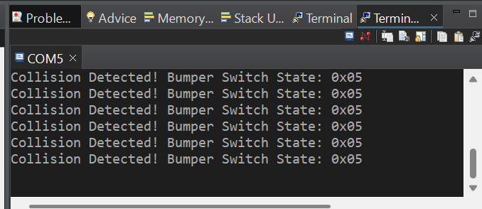
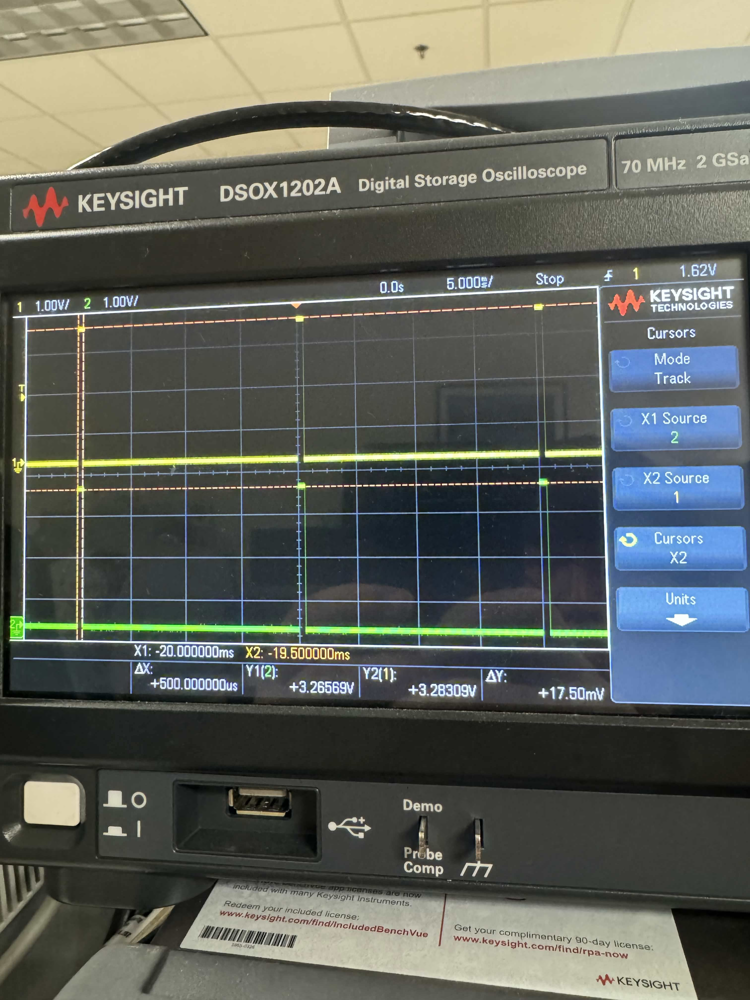
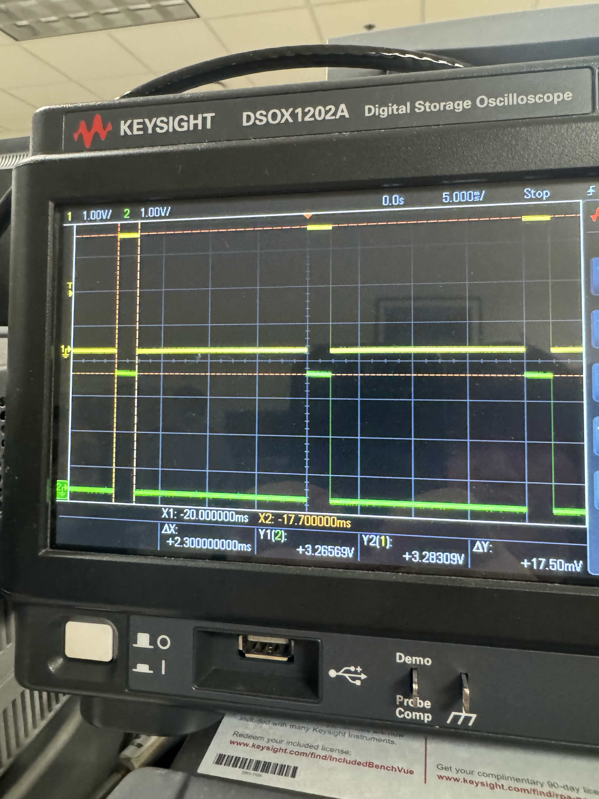

# ECE 528/L - Robotics and Embedded Systems with Lab
**CSU Northridge**

**Department of Electrical and Computer Engineering**

## Motor Control Lab
The Motor Control lab interfaces with the following:

* User LEDs of the TI MSP432 LaunchPad
* Pololu Gearmotor with Encoder - [Product Link](https://www.pololu.com/product/3675)
* Left Bumper Switches for TI-RSLK MAX - [Product Link](https://www.pololu.com/product/3673)
* Right Bumper Switches for TI-RSLK MAX - [Product Link](https://www.pololu.com/product/3674)
* HS-485HB Servo-Stock Rotation - [Product Link](https://www.servocity.com/hs-485hb-servo/)

# ECE 528/L - Robotics and Embedded Systems with Lab
**CSU Northridge**

**Department of Electrical and Computer Engineering**

## Motor Control Lab

### Overview

The Motor Control lab introduces Pulse Width Modulation (PWM) and edge triggered interrupts whilst utilizing the MSP432 LaunchPad and TI-RSLK MAX Chassis. In this lab, we've comfigured Timer_A to generate PWM signals and have set up the GPIO pins to use edge-triggered interrupts, that will drive both the DC motors and servos. 

The motor lab assignment also demonstrates how to use the bumper switches located on the TI-RSLK MAX chassis for collision handling.

By the completion of this lab, we were able to:
* Utilize fundamental characteristics of Pulse Width Modulation (PWM), along with the proper applications
* Configure Timer_A in order to produce PWM signals
* Configure the GPIO pins necessary for the bumper switches and utilize edge-triggered interrupts and collision handling
* Incorporate coding techniques (e.g. global veriable sharing in interrupt tasks) for efficient and correct output results
* Verify the correctness of our outputs using an oscilloscope, and use the oscilloscope to observe the bouncing effect caused by the bumper switches

### Components Used

| Description | Quantity | Manufacturer |
| ----------- | -------- | ------------ |
| MSP432 Launch Pad | 1 | Texas Instruments |
| USB-A to Micro-USB Cable | 1 | N/A |
| TI-RSLK MAX Chassis  | 1 | Pololu |
| Bumper Switches | 2 | Polulu |
| HS-485HB Servo | 2 | ServoCity |
| Oscilloscope  | 1 | N/A |
| Oscilloscope Probes  | 2 | N/A |
| Jumper Wires | 4+ | N/A |
| Breadboard | 1 | N/A |

### Analysis and Results

This was the terminal output when pressing the bumper switches.

This was the oscilloscope outputs when different duty cycles were added.

### Known Issues and Limitations

Two problems showed up on the first run. The robot did not move, and a bumper press looked stuck after it was released.

The motors stayed still because Timer A0 was started with the wrong clock. Its control register selected the external TAxCLK input instead of SMCLK, so no PWM pulses reached P2.6 and P2.7. The motor enable pins were set, but the driver had no PWM signal to follow. The control register was changed to `0x02F0`, which selects SMCLK, divides that clock by 8, and runs the timer in up/down mode. That is the same arrangement Timer A2 already used for the servos. With a period constant of 15000, the PWM period is 20 ms, and the duty-cycle writes now change the motor speed.

The bumpers looked stuck because a press was latched and never cleared. Three things caused that:

* The pin mask was `0xE7` instead of `0xED`. That left out P4.3 (BUMP_2) and enabled unused P4.1. All six bumper pins now use `0xED`.
* `collision_detected` was set on a press, but `Handle_Collision()` was not running, so the flag and the chassis red LEDs stayed on.
* Later presses were ignored while that flag stayed set.

The main loop now stops the motors as soon as a bumper interrupt is accepted, backs up, turns right, and then clears `collision_detected` and the red LEDs so another collision can be detected. Switch bounce is rejected inside the PORT4 interrupt: the pins are read again, and the collision handler runs only if the switch that caused the interrupt is still pressed. An earlier version waited out a 10 ms debounce window on every delay, which spent extra CPU time. The single confirmation read replaced that wait.

One limitation remains. The bounce check is one extra read, not a timed debounce window, so a slow contact bounce can still be counted as a press. The servo sweep is also commented out while the robot runs the forward-and-recover loop.

### Author Contribution
                   
| Lab Report Contributions| Group Member | Implementation Contributions | Group Member |
| ---- | ------------ | ------- | ------- |
|Overview | Feranmi | Source Code | Brandon & Feranmi |
| Components Used | Feranmi | Robot Demonstration | Brandon & Feranmi |
| Analysis and Results | Brandon | Oscilliscope Testing | Brandon |
| Known Issues and Limitations | Brandon 
| Author Contribution | Brandon & Feranmi |
| References | Feranmi |

### References
[1] Texas Instruments, MSP432P401R SimpleLink Microcontroller LaunchPad Development Kit (MSP-EXP432P401R) User’s Guide, SLAU597F, rev. F, Mar. 2018. Accessed: Oct. 9, 2026. [Online]. Available: LaunchPad user’s guide.

[2] Texas Instruments, Texas Instruments Robotics System Learning Kit User Guide, SEKP166, 2019. Accessed: Oct. 9, 2026. [Online]. Available: TI-RSLK MAX user guide.

[3] Pololu Corporation, “Bumper switch assemblies for Romi/TI-RSLK MAX,” schematic diagram, 2019. Accessed: Oct. 9, 2026. [Online]. Available: Bumper switch assemblies schematic.

[4] Hitec, “HS-485HB general specification,” datasheet, n.d. Accessed: Oct. 9, 2026. [Online]. Available: HS-485HB datasheet.

[5] Texas Instruments, Code Composer Studio User’s Guide, ver. 20.2.0. Accessed: Oct. 9, 2026. [Online]. Available: Code Composer Studio documentation.

[6] Microsoft, “Documentation for Visual Studio Code.” Accessed: Oct. 9, 2026. [Online]. Available: Visual Studio Code documentation.

[7] Keysight Technologies, Keysight InfiniiVision 1200 X-Series and EDUX1052A/G Oscilloscopes User’s Guide, 3rd ed., manual no. N2137-97015, Jan. 2020. Accessed: Oct. 9, 2026. [Online]. Available: Oscilloscope user’s guide.

[8] Texas Instruments, “Debounce a switch,” application brief SCEA094, Oct. 2020. Accessed: Oct. 9, 2026. [Online]. Available: Debounce a switch.

(Professor Notes)
The Motor Control lab interfaces with the following:
* User LEDs of the TI MSP432 LaunchPad
* Pololu Gearmotor with Encoder - [Product Link](https://www.pololu.com/product/3675)
* Left Bumper Switches for TI-RSLK MAX - [Product Link](https://www.pololu.com/product/3673)
* Right Bumper Switches for TI-RSLK MAX - [Product Link](https://www.pololu.com/product/3674)
* HS-485HB Servo-Stock Rotation - [Product Link](https://www.servocity.com/hs-485hb-servo/)